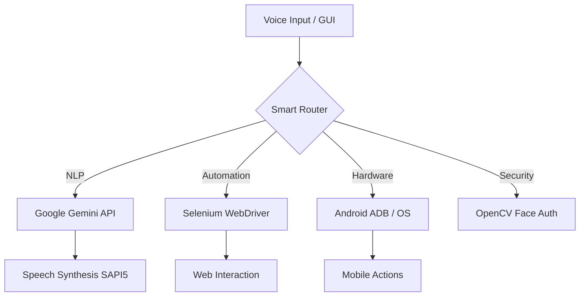

<div align="center">
  

  # 🌌 Zarvis: The Autonomous AI Ecosystem
  
  **"Engineering the bridge between human intent and machine execution."**
  
  [](https://www.python.org/)
  [](https://aistudio.google.com/)
  [](https://www.selenium.dev/)
  [](https://github.com/python-eel/Eel)
  [](https://opencv.org/)

  <p align="center">
    <a href="#-core-intelligence">Features</a> •
    <a href="#-technical-architecture">Architecture</a> •
    <a href="#-tech-stack">Stack</a> •
    <a href="#-getting-started">Installation</a> •
    <a href="#-author">Developer</a>
  </p>
</div>

---

## 📖 Overview

**Zarvis** (Zarvis: The Next-Gen AI Assistant) is not just another voice assistant—it is a sophisticated **Autonomous Ecosystem** designed to bridge the gap between creative thought and execution. Built for developers and power users, Zarvis combines high-level NLP via **Google Gemini**, real-time automation using **Selenium**, and biometric security to create a truly personalized interface.

Whether it's automating complex LeetCode workflows, managing communication via Android ADB, or providing intelligent context-aware responses, Zarvis is engineered to be the ultimate companion for the modern engineer.

---

## 🚀 Core Intelligence

### 🤖 Autonomous Developer Agent
*   **LeetCode Solver**: Automatically navigates to problems, generates optimal solutions using Gemini 1.5, injects code into the editor, and submits—all through voice commands.
*   **API Integration**: Real-time fetching of GitHub and LeetCode statistics to track personal growth dynamically.
*   **Smart Navigation**: Context-aware URL mapping allows for "Open my most recent project" style interactions.

### 🔐 Enterprise-Grade Security
*   **Visual Biometrics**: Integrated OpenCV and Face Recognition models ensure access is restricted to authorized users.
*   **Voice Verification**: Multi-factor authentication layer using vocal frequency analysis.

### 🎙️ Advanced Interaction
*   **Zero-Latency Wake Word**: Powered by Picovoice Porcupine for high-accuracy background listening ("Hey Friday").
*   **Conversational Memory**: Utilizes a model chain (Gemini Flash → Pro) to ensure responses are always accurate and helpful.

### 📱 Hardware Orchestration
*   **Android Bridge (ADB)**: Seamlessly makes calls and sends messages via a physical device using simulated tap events and direct intent broadcasting.
*   **System Mastery**: Complete control over OS-level actions, browser automation, and multimedia playback.

---

## 🏗️ Technical Architecture

Zarvis is built on a modular, multi-threaded architecture designed for scalability and minimal latency.



### Key Engineering Challenges Solved:
*   **Multi-Threading**: Implemented a robust threading model to ensure the UI remains responsive while background listeners and hotword detectors are active.
*   **Browser Hijacking Protection**: Used custom Selenium flags to bypass automation detection on complex platforms like LeetCode.
*   **Fallback Logic**: Engineered a model chain (Gemini -> Wikipedia -> Local DB) to ensure 99% query fulfillment.

---

## 🛠️ Tech Stack

| Layer | Technologies |
| :--- | :--- |
| **Logic/NLP** | Python 3.8+, Google GenAI (Gemini), HugChat, Wikipedia API |
| **Frontend** | Eel (Python-to-JS bridge), HTML5, CSS3/SCSS, Vanilla JS |
| **Automation** | Selenium WebDriver, PyAutoGUI, ADB (Android Debug Bridge) |
| **Recognition** | Google Speech Recognition, Picovoice Porcupine (Hotword) |
| **Synthesis** | Pyttsx3 (SAPI5 Engine) |
| **Computer Vision** | OpenCV, Dlib, Face Recognition |
| **Database** | SQLite3 |

---

## 🚀 Getting Started

### Prerequisites
*   Python 3.8 or higher
*   Chrome Browser (Required for Eel and Selenium)
*   [Google Gemini API Key](https://aistudio.google.com/app/apikey) (Free)

### Installation

1. **Clone the Project**
   ```bash
   git clone https://github.com/TusarGoswami/zarvis-tusar-edition.git
   cd zarvis-tusar-edition
   ```

2. **Environment Setup**
   ```bash
   python -m venv venv
   source venv/bin/activate  # On Windows: venv\Scripts\activate
   pip install -r requirements.txt
   ```

3. **Configure Environment**
   Create a `.env` file in the root directory:
   ```env
   GEMINI_API_KEY=your_key_here
   LEETCODE_USERNAME=your_username
   GITHUB_USERNAME=your_username
   ```

4. **Launch**
   ```bash
   python main.py
   ```

---

## 🛣️ Roadmap & Vision

- [ ] **Desktop Integration**: Universal search and file manipulation.
- [ ] **Home Automation**: MQTT integration for IoT control.
- [ ] **Advanced Vision**: Real-time object detection and spatial awareness.
- [ ] **Cloud Sync**: Encrypted database sync across multiple instances.

---

## 💡 Engineering Highlights

### Design Decisions
*   **Decoupled Architecture**: By using **Eel**, the project maintains a clear separation between the Python-based logic core and the web-based GUI, allowing for easier UI iterations without touching the backend.
*   **Reliability through Multi-Threading**: The assistant uses a multi-threaded approach to ensure the **Hotword Listener** (Porcupine) never misses a wake-word while the GUI is rendering animations.
*   **Fail-Safe NLP**: Implemented a **Model Chain** logic—if the primary Gemini 1.5 model hits a rate limit or API failure, Zarvis gracefully falls back to Wikipedia or local rule-based responses.
*   **Security First**: Unlike many open-source assistants, Zarvis implements a **Biometric Gatekeeper**. Access to system-level commands is physically locked until the owner is visually verified.

---

## 👤 Author

**Tusar Goswami**
*Full-Stack Engineer & AI Enthusiast*

[](https://www.linkedin.com/in/tusar-goswami-33a39824b/)
[](https://github.com/TusarGoswami)

---

<div align="center">
  <sub>Built with ❤️ by Tusar Goswami. Bringing science fiction to life, one line of code at a time.</sub>
</div>
