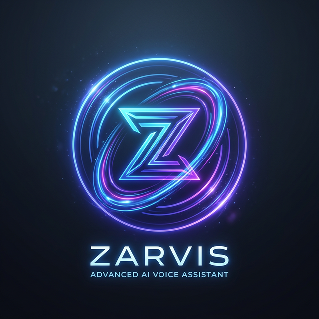

<div align="center">
  

  # Zarvis: The Next-Gen AI Assistant (Tusar Edition)
  
  **An advanced, secure, and highly capable virtual assistant powered by Python and web technologies.**
  
  [](https://www.python.org/)
  [](https://github.com/python-eel/Eel)
  [](https://opencv.org/)
  [](https://pypi.org/project/SpeechRecognition/)
</div>

<br/>

## 🌌 Overview

**Zarvis** is a highly personalized, state-of-the-art voice assistant built exclusively for **Tusar**. Moving beyond standard voice interfaces, Zarvis features a dual-layer biometric security system and a sleek graphical user interface built with HTML/CSS and Eel. 

Designed to seamlessly integrate into your workflow, Zarvis handles everything from automating LeetCode problem solving to initiating WhatsApp calls—all hands-free.

---

## ✨ Core Features

### 🔐 Unbreakable Security
- **Face Authentication**: Uses computer vision to verify your identity before granting access.
- **Voice Biometrics**: A secondary layer of security ensures that only *your* voice can interact with the system.

### 🎙️ Immersive Voice Control
- **Wake Word Activation**: Always listening in the background for phrases like *"Hey Friday"* or *"Hey Jarvis"*.
- **Natural Language Execution**: Talk naturally to execute complex multi-step commands.

### 💻 Developer Centric
- **LeetCode Automation**: Ask Zarvis to open, solve, run, and submit LeetCode problems autonomously!
- **GitHub Integration**: Quickly pull up your GitHub profile or check repositories.
- **Terminal-Free Execution**: Smart URL navigation and background program execution.

### 📱 Smart Communication
- **WhatsApp Integration**: Send messages or make video/voice calls effortlessly.
- **Phone Calls**: Directly connect with your contacts hands-free.

### 🌐 Multimedia & Web
- **YouTube Controller**: Play videos, search topics, and control playback.
- **Google Search Integration**: Instant answers backed by web search capabilities.
- **System Actions**: Queries for time, date, and basic OS control.

---

## 🛠️ Tech Stack

- **Backend Logic**: Python
- **Frontend GUI**: Eel (Python to HTML/JS bridge) running on Chrome App mode
- **Speech-to-Text**: `speech_recognition`, Google Web Speech API
- **Text-to-Speech**: `pyttsx3` (SAPI5)
- **Computer Vision**: OpenCV / `face_recognition` models
- **Web Automation**: Selenium / WebBrowser

---

## 🚀 Getting Started

### Prerequisites
Make sure you have Python 3.8+ installed along with Chrome browser. 

### Installation
1. Clone the repository:
   ```bash
   git clone https://github.com/TusarGoswami/zarvis-tusar-edition.git
   ```
2. Set up the virtual environment:
   ```bash
   python -m venv myenv
   myenv\Scripts\activate
   ```
3. Install the dependencies:
   ```bash
   pip install -r requirements.txt
   ```
   *(Ensure you have necessary C++ build tools installed for `dlib` and `face_recognition`)*

### Running Zarvis
Launch the main application script:
```bash
python main.py
```
Zarvis will boot up the GUI, initialize the camera for face recognition, and then prompt for voice verification.

---

## 📸 Screenshots

<div align="center">
  
  <p><i>The sleek holographic interface of Zarvis.</i></p>
</div>

---

## 🧑‍💻 Developed by

**Tusar Goswami**  
*Turning science fiction into reality.*
